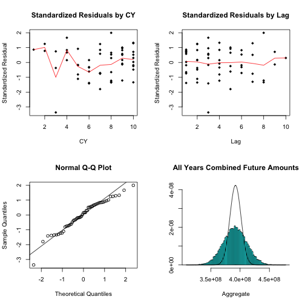

```r
library(mvtnorm)
library(MASS)
library(abind)
library(stochasticreserver)
```

## Initialize Triangle

Input (B0) is a development array of cumulative averages with a the
 exposures (claims) used in the denominator appended as the last column.
 Assumption is for the same development increments as exposure increments
 and that all development lags with no development have # been removed.
Data elements that are not available are indicated as such.  This should
work (but not tested for) just about any subset of an upper triangular
data matrix.  
Another requirement of this code is that the matrix contain
no columns that are all zero.


```r
B0 = matrix(c(670.25868,1480.24821,1938.53579,2466.25469,2837.84888,3003.52391,
            3055.38674,3132.93838,3141.18638,3159.72524,
            767.98833,1592.50266,2463.79447,3019.71976,3374.72689,3553.61387,3602.27898,
            3627.28386,3645.5656,NA,
            740.57952,1615.79681,2345.85028,2910.52511,3201.5226,3417.71335,3506.58672,
            3529.00243,NA,NA,
            862.11956,1754.90405,2534.77727,3270.85361,3739.88962,4003.00219,4125.30694,
            NA,NA,NA,
            840.94172,1859.02531,2804.54535,3445.34665,3950.47098,4185.95298,NA,NA,NA,NA,
            848.00496,2052.922,3076.13789,3861.03111,4351.57694,NA,NA,NA,NA,NA,
            901.77403,1927.88718,3003.58919,3881.41744,NA,NA,NA,NA,NA,NA,
            935.19866,2103.97736,3181.75054,NA,NA,NA,NA,NA,NA,NA,
            759.32467,1584.91057,NA,NA,NA,NA,NA,NA,NA,NA,
            723.30282,NA,NA,NA,NA,NA,NA,NA,NA,NA),10,10,byrow = TRUE)
dnom = c(39161.,38672.4628,41801.048,42263.2794,41480.8768,40214.3872,43598.5056,
       42118.324,43479.4248,49492.4106)

size <- nrow(B0)
# Identify model to be used
#   Berquist for the Berquist-Sherman Incremental Severity
#   CapeCod for the Cape Cod
#   Hoerl for the Generalized Hoerl Curve Model with trend
#   Wright for the Generalized Hoerl Curve with individual accident year levels
#   Chain for the Chain Ladder model
#model = "Berquist"
#model = "CapeCod"
model = "Hoerl"
#model = "Wright"
#model = "Chain"
# Toggle graphs off if desired
graphs = TRUE

# Toggle simulations off if desired
simulation = TRUE
```

```r
# Set tau to have columns with entries 1 through size
tau = t(array((1:size), c(size, size)))

# Calculate incremental average matrix
A0 = cbind(B0[, 1], (B0[, (2:size)] + 0 * B0[, (1:(size - 1))]) -
             (B0[, (1:(size - 1))] + 0 * B0[, (2:size)]))

# Generate a matrix to reflect exposure count in the variance structure
logd = log(matrix(dnom, size, size))

# Set up matrix of rows and columns, makes later calculations simpler
rowNum = row(A0)
colNum = col(A0)

# msk is a mask matrix of allowable data, upper triangular assuming same
# development increments as exposure increments, msn picks off the first
# forecast diagonal, msd picks off the to date diagonal
msk = (size - rowNum) >= colNum - 1
msn = (size - rowNum) == colNum - 2
msd = (size - rowNum) == colNum - 1

# Amount paid to date
ptd = rowSums(B0 * msd, na.rm = TRUE)
```

## START OF MODEL SPECIFIC CODE 


```r
  if (model == "Berquist") {
    model_lst <- berquist(tau, B0, ptd, msk)
  } else if (model == "CapeCod") {
    model_lst <- capecod(tau, B0, ptd, msk)
  } else if (model == "Hoerl") {
    model_lst <- hoerl(tau, B0, ptd, msk)
  } else if (model == "Wright") {
    model_lst <- wright(tau, B0, ptd, msk)
  } else if (model == "Chain") {
    model_lst <- chain(tau, B0, ptd, msk)
  }
g.obj <- model_lst$g.obj
g.grad <- model_lst$g.grad
g.hess <- model_lst$g.hess
a0 <- model_lst$a0
```

## Negative Loglikelihood Function to be Minimized

Note that the general
form of the model has parameters in addition to those in the loss model,
namely the power for the variance and the constant of proprtionality that
varies by column.  So if the original model has k parameters with size
columns of data, the total objective function has k+11 parameters


```r
l.obj = function(a, A) {
  npar = length(a) - 2
  e = g.obj(a[1:npar])
  v = exp(-outer(logd[, 1], rep(a[npar + 1], size), "-")) * (e^2)^a[npar + 2]
  t1 = log(2 * pi * v) / 2
  t2 = (A - e) ^ 2 / (2 * v)
  sum(t1 + t2, na.rm = TRUE)
}
# Gradient of the objective function
l.grad = function(a, A) {
  npar = length(a) - 2
  p = a[npar + 2]
  Av = aperm(array(A, c(size, size, npar)), c(3, 1, 2))
  e = g.obj(a[1:npar])
  ev = aperm(array(e, c(size, size, npar)), c(3, 1, 2))
  v = exp(-outer(logd[, 1], rep(a[npar + 1], size), "-")) * (e^2)^p
  vv = aperm(array(v, c(size, size, npar)), c(3, 1, 2))
  dt = rowSums(g.grad(a[1:npar]) * ((p / ev) + (ev - Av) / vv - p * 
                                      (Av - ev)^2 / (vv * ev)),
               na.rm = TRUE,
               dims = 1)
  yy = 1 - (A - e) ^ 2 / v
  dk = sum(yy / 2, na.rm = TRUE)
  dp = sum(yy * log(e ^ 2) / 2, na.rm = TRUE)
  c(dt, dk, dp)
}
```

## Hessian of the objective function

-   e is the expectated value matrix
-   v is the matrix of variances
-   A, e, v all have shape c(size, size)
-   The variables _v are copies of the originals to shape c(npar,size,size), paralleling
    the gradient of g.
-   The variables _m are copies of the originals to shape c(npar,npar,size,size),
    paralleling the hessian of g


```r
l.hess = function(a, A) {
  npar = length(a) - 2
  p = a[npar + 2]
  Av = aperm(array(A, c(size, size, npar)), c(3, 1, 2))
  Am = aperm(array(A, c(size, size, npar, npar)), c(3, 4, 1, 2))
  e = g.obj(a[1:npar])
  ev = aperm(array(e, c(size, size, npar)), c(3, 1, 2))
  em = aperm(array(e, c(size, size, npar, npar)), c(3, 4, 1, 2))
  v = exp(-outer(logd[, 1], rep(a[npar + 1], size), "-")) * (e ^ 2) ^ p
  vv = aperm(array(v, c(size, size, npar)), c(3, 1, 2))
  vm = aperm(array(v, c(size, size, npar, npar)), c(3, 4, 1, 2))
  g1 = g.grad(a[1:npar])
  gg = aperm(array(g1, c(npar, size, size, npar)), c(4, 1, 2, 3))
  gg = gg * aperm(gg, c(2, 1, 3, 4))
  gh = g.hess(a[1:npar])
  dtt = rowSums(
    gh * (p / em + (em - Am) / vm - p * (Am - em) ^ 2 / (vm * em)) +
      gg * (
        1 / vm + 4 * p * (Am - em) / (vm * em) + p * (2 * p + 1) * (Am - em) ^ 2 /
          (vm * em ^ 2) - p / em ^ 2
      ),
    dims = 2,
    na.rm = TRUE
  )
  dkt = rowSums((g1 * (Av - ev) + p * g1 * (Av - ev) ^ 2 / ev) / vv, na.rm = TRUE)
  dtp = rowSums(g1 * (1 / ev + (
    log(ev ^ 2) * (Av - ev) + (p * log(ev ^ 2) - 1) * (Av - ev) ^ 2 / ev
  ) / vv),
  na.rm = TRUE)
  dkk = sum((A - e) ^ 2 / (2 * v), na.rm = TRUE)
  dpk = sum(log(e ^ 2) * (A - e) ^ 2 / (2 * v), na.rm = TRUE)
  dpp = sum(log(e ^ 2) ^ 2 * (A - e) ^ 2 / (2 * v), na.rm = TRUE)
  m1 = rbind(array(dkt), c(dtp))
  rbind(cbind(dtt, t(m1)), cbind(m1, rbind(cbind(dkk, c(
    dpk
  )), c(dpk, dpp))))
}
```


End of funciton specificaitons now on to the minimization

## Minimization

### Get starting values for kappa and p parameters, default 10 and 1

```r
ttt = c(10, 1)
```

For starting values use fitted objective function and assume variance for a
cell is estimated by the square of the difference between actual and expected
averages.  Note since log(0) is -Inf we need to go through some machinations
to prep the y values for the fit


```r
E = g.obj(a0)
yyy = (A0 - E)^2
yyy = logd + log(((yyy != 0) * yyy) - (yyy == 0))
sss = na.omit(data.frame(x = c(log(E^2)), y = c(yyy)))
ttt = array(coef(lm(sss$y ~ sss$x)))[1:2]
a0 = c(a0, ttt)

set.seed(1) # to check reproducibility with original code
max = list(iter.max = 10000, eval.max = 10000)
```

### Actual minimization

```r
mle = nlminb(a0, l.obj, gradient = l.grad, hessian = l.hess, 
             scale = abs(1 / (2 * ((a0 * (a0 != 0)) + (1 * (a0 == 0))))),
             A = A0, control = max)
```

### Model statistics

-   __mean__ and __var__ are model fitted values
-   __stres__ is the standardized residuals


```r
npar = length(a0) - 2
p = mle$par[npar + 2]
mean = g.obj(mle$par[1:npar])
var = exp(-outer(logd[, 1], rep(mle$par[npar + 1], size), "-")) * (mean ^
                                                                   2) ^ p
stres = (A0 - mean) / sqrt(var)
g1 = g.grad(mle$par[1:npar])
gg = aperm(array(g1, c(npar, size, size, npar)), c(4, 1, 2, 3))
gg = gg * aperm(gg, c(2, 1, 3, 4))
meanv = aperm(array(mean, c(size, size, npar)), c(3, 1, 2))
meanm = aperm(array(mean, c(size, size, npar, npar)), c(3, 4, 1, 2))
varm = aperm(array(var, c(size, size, npar, npar)), c(3, 4, 1, 2))
```

### Masks to screen out NA entries in original input matrix


```r
s = 0 * A0
sv = aperm(array(s, c(size, size, npar)), c(3, 1, 2))
sm = aperm(array(s, c(size, size, npar, npar)), c(3, 4, 1, 2))
```
### Calculate the information matrix

-   Using second derivatives of the log likelihood function
Second with respect to theta parameters

```r
tt = rowSums(sm + gg * (1 / varm + 2 * p ^ 2 / (meanm ^ 2)), dims = 2, na.rm = TRUE)
```

Second with respect to theta and kappa

```r
kt = p * rowSums(sv + g1 / meanv, na.rm = TRUE)
```

Second with respect to p and theta


```r
tp = p * rowSums(sv + g1 * log(meanv ^ 2) / meanv, na.rm = TRUE)
```

Second with respect to kappa

```r
kk = (1 / 2) * sum(1 + s, na.rm = TRUE)
```

Second with respect to p and kappa

```r
pk = (1 / 2) * sum(s + log(mean ^ 2), na.rm = TRUE)
```

Second with respect to p

```r
pp = (1 / 2) * sum(s + log(mean ^ 2) ^ 2, na.rm = TRUE)
```
### Create information matrix in blocks


```r
m1 = rbind(array(kt), c(tp))
inf = rbind(cbind(tt, t(m1)), cbind(m1, rbind(c(kk, pk), c(pk, pp))))
```
# Variance-covariance matrix for parameters, inverse of information matrix

```r
vcov = solve(inf)
```

### Simulation

Initialize simulation array to keep simulation results


```r
sim = matrix(0, 0, 11)
smn = matrix(0, 0, 11)
spm = matrix(0, 0, npar + 2)
```


Simulation for distribution of future amounts

Want 10,000 simulations, but exceeds R capacity, so do in batches of 5,000


```r
nsim = 5000
smsk = aperm(array(c(msk), c(size, size, nsim)), c(3, 1, 2))
smsn = aperm(array(c(msn), c(size, size, nsim)), c(3, 1, 2))

if (simulation) {
  for (i in 1:5) {
    # Randomly generate parameters from multivariate normal
    spar = rmvnorm(nsim, mle$par, vcov)

    # Arrays to calculate simulated means
    esim = g.obj(spar)

    # Arrays to calculate simulated variances
    ksim = exp(aperm(outer(array(
      spar[, c(npar + 1)], c(nsim, size)
    ), log(dnom), "-"), c(1, 3, 2)))
    psim = array(spar[, npar + 2], c(nsim, size, size))
    vsim = ksim * (esim ^ 2) ^ psim

    # Randomly simulate future averages
    temp = array(rnorm(nsim * size * size, c(esim), sqrt(c(vsim))), c(nsim, size, size))

    # Combine to total by exposure period and in aggregate
    # notice separate array with name ending in "n" to capture
    # forecast for next accounting period
    sdnm = t(matrix(dnom, size, nsim))
    fore = sdnm * rowSums(temp * !smsk, dims = 2)
    forn = sdnm * rowSums(temp * smsn, dims = 2)

    # Cumulate and return for another 5,000
    sim = rbind(sim, cbind(fore, rowSums(fore)))
    smn = rbind(smn, cbind(forn, rowSums(forn)))
    spm = rbind(spm, spar)
  }
}
```
## Print Results

```r
model
```

```
## [1] "Hoerl"
```

```r
model_description(model)
```

```
## [1] "Generalized Hoerl Curve Model with Trend"
```

```r
summary(sim)
```

```
##        V1          V2                 V3                 V4          
##  Min.   :0   Min.   :-2208490   Min.   :-3804527   Min.   :-5992989  
##  1st Qu.:0   1st Qu.:  -21117   1st Qu.:  367584   1st Qu.: 1840551  
##  Median :0   Median :  182624   Median :  832281   Median : 2737909  
##  Mean   :0   Mean   :  187219   Mean   :  852369   Mean   : 2764779  
##  3rd Qu.:0   3rd Qu.:  392581   3rd Qu.: 1324325   3rd Qu.: 3665383  
##  Max.   :0   Max.   : 2337207   Max.   : 5463162   Max.   : 9796623  
##        V5                 V6                 V7          
##  Min.   :-2673996   Min.   : 2973114   Min.   :18415004  
##  1st Qu.: 5895531   1st Qu.:15056985   1st Qu.:36558098  
##  Median : 7417472   Median :17391073   Median :40191121  
##  Mean   : 7433759   Mean   :17428167   Mean   :40198575  
##  3rd Qu.: 8952586   3rd Qu.:19775174   3rd Qu.:43786949  
##  Max.   :17823691   Max.   :33324982   Max.   :64044023  
##        V8                  V9                 V10           
##  Min.   : 42635180   Min.   : 84602187   Min.   :147458026  
##  1st Qu.: 67656581   1st Qu.:117555956   1st Qu.:197239795  
##  Median : 72765035   Median :124469665   Median :207118943  
##  Mean   : 72769286   Mean   :124641424   Mean   :207451820  
##  3rd Qu.: 77764124   3rd Qu.:131567817   3rd Qu.:217428116  
##  Max.   :106540770   Max.   :173366354   Max.   :271965621  
##       V11           
##  Min.   :348584519  
##  1st Qu.:453264017  
##  Median :473033240  
##  Mean   :473727397  
##  3rd Qu.:493480419  
##  Max.   :606557866
```

```r
summary(smn)
```

```
##        V1          V2                 V3                 V4          
##  Min.   :0   Min.   :-2208490   Min.   :-3115594   Min.   :-3068350  
##  1st Qu.:0   1st Qu.:  -21117   1st Qu.:  237639   1st Qu.: 1158427  
##  Median :0   Median :  182624   Median :  630842   Median : 1853083  
##  Mean   :0   Mean   :  187219   Mean   :  640646   Mean   : 1857638  
##  3rd Qu.:0   3rd Qu.:  392581   3rd Qu.: 1043496   3rd Qu.: 2560199  
##  Max.   :0   Max.   : 2337207   Max.   : 3971738   Max.   : 6843497  
##        V5                 V6                 V7          
##  Min.   :-4249322   Min.   :  672065   Min.   : 6333106  
##  1st Qu.: 3487607   1st Qu.: 8249938   1st Qu.:18143629  
##  Median : 4616366   Median : 9867620   Median :20452592  
##  Mean   : 4606687   Mean   : 9879531   Mean   :20497593  
##  3rd Qu.: 5722689   3rd Qu.:11498718   3rd Qu.:22806770  
##  Max.   :11746388   Max.   :19262639   Max.   :35413380  
##        V8                 V9                V10          
##  Min.   :12362698   Min.   :23576556   Min.   :33066545  
##  1st Qu.:29265167   1st Qu.:42456948   1st Qu.:54880593  
##  Median :32271226   Median :46051469   Median :59310793  
##  Mean   :32277564   Mean   :46118371   Mean   :59372552  
##  3rd Qu.:35256668   3rd Qu.:49811006   3rd Qu.:63722832  
##  Max.   :53006982   Max.   :72609638   Max.   :86736032  
##       V11           
##  Min.   :129752423  
##  1st Qu.:167087821  
##  Median :175382878  
##  Mean   :175437801  
##  3rd Qu.:183644510  
##  Max.   :230595466
```

## Scatter plots of residuals & Distribution of Forecasts


```r
if (graphs) {
  #x11(title = model_description(model))

  # Prep data for lines for averages in scatter plots of standardized residuals
  ttt = array(cbind(c(rowNum + colNum - 1), c(stres)), 
              c(length(c(stres)), 2, 19))
  sss = t(array((1:19), c(19, length(c(stres)))))

  # Plotting
  par(mfrow = c(2, 2))
  plot(
    na.omit(cbind(c(rowNum + colNum - 1), c(stres))),
    main = "Standardized Residuals by CY",
    xlab = "CY",
    ylab = "Standardized Residual",
    pch = 18
  )
  lines(na.omit(list(
    x = (1:19),
    y = colSums(ttt[, 2, ] *
                  (ttt[, 1, ] == sss), na.rm = TRUE) /
      colSums((ttt[, 1, ] == sss) +
                0 *
                ttt[, 2, ], na.rm = TRUE)
  )), col = "red")
  plot(
    na.omit(cbind(c(colNum), c(stres))),
    main = "Standardized Residuals by Lag",
    xlab = "Lag",
    ylab = "Standardized Residual",
    pch = 18
  )
  lines(na.omit(list(
    x = colNum[1, ],
    y = colSums(stres, na.rm = TRUE) /
      colSums(1 + 0 * stres, na.rm = TRUE)
  )), col = "red")
  qqnorm(c(stres))
  qqline(c(stres))
  if (simulation) {
    proc = list(x = (density(sim[, 11]))$x,
                y = dnorm((density(sim[, 11]))$x,
                          sum(matrix(c(
                            dnom
                          ), size, size) * mean * !msk),
                          sqrt(sum(
                            matrix(c(dnom), size, size) ^ 2 * var * !msk
                          ))))
    truehist(sim[, 11],
             ymax = max(proc$y),
             main = "All Years Combined Future Amounts",
             xlab = "Aggregate")
    lines(proc)
  }
}
```


## Summary From Simulation

Summary of mean, standard deviation, and 90% confidence interval from
simulation, similar for one-period forecast


```r
sumr = matrix(0, 0, 4)
sumn = matrix(0, 0, 4)

for (i in 1:11) {
  sumr = rbind(sumr, c(mean(sim[, i]), sd(sim[, i]), quantile(sim[, i], c(.05, .95))))
  sumn = rbind(sumn, c(mean(smn[, i]), sd(smn[, i]), quantile(smn[, i], c(.05, .95))))
}
sumr
```

```
##                                       5%         95%
##  [1,]         0.0        0.0         0.0         0.0
##  [2,]    187218.8   353761.7   -369841.5    771157.4
##  [3,]    852369.4   772535.9   -380479.7   2139129.1
##  [4,]   2764779.0  1423821.4    477583.3   5125608.7
##  [5,]   7433758.5  2324640.2   3648857.0  11230492.1
##  [6,]  17428166.6  3534255.6  11707287.6  23288978.3
##  [7,]  40198575.3  5398539.0  31437358.2  49159689.5
##  [8,]  72769285.8  7522855.3  60449526.0  85209982.7
##  [9,] 124641423.8 10528687.6 107631732.4 142319135.4
## [10,] 207451819.6 15348515.7 182707406.7 233387503.6
## [11,] 473727396.8 29753777.6 426184913.1 523884658.5
```

```r
sumn
```

```
##                                        5%         95%
##  [1,]         0.0        0.0         0.00         0.0
##  [2,]    187218.8   353761.7   -369841.53    771157.4
##  [3,]    640646.4   650084.5   -414251.81   1707212.6
##  [4,]   1857638.2  1084140.1     97447.16   3637977.1
##  [5,]   4606686.8  1674886.5   1854988.61   7323039.9
##  [6,]   9879531.2  2435095.3   5867670.36  13873959.3
##  [7,]  20497593.0  3517316.7  14703500.28  26303795.5
##  [8,]  32277564.1  4510385.1  24954391.59  39750930.9
##  [9,]  46118371.0  5547381.1  37074538.57  55339176.1
## [10,]  59372551.6  6615812.4  48611660.50  70333442.5
## [11,] 175437801.1 12401775.7 155072276.37 195956054.9
```
